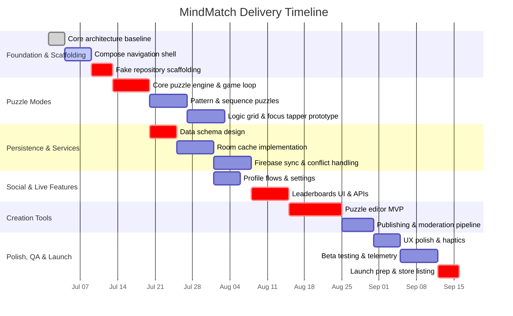

# MindMatch

MindMatch is an Android puzzle arcade designed to sharpen memory, focus, and logical reasoning through quick, replayable brain-training challenges. Players progress through curated mini-games, unlock tougher variants, and share their own creations with the community.

## Current State

- Jetpack Compose single-activity app with Material 3 styling.
- Bottom navigation shell connecting dashboard, puzzle library, creation tools, daily challenge, leaderboards, and profile management.
- Fake in-memory repository seeds sample puzzles, progress, and leaderboard data for prototyping.
- Clean architecture layering planned around MVC-inspired game loops (model/game state, Compose views, controller logic).

## Feature Roadmap

| Area | Description |
| --- | --- |
| Profiles | Create/update/delete a player profile; sync locally or via Firebase. |
| Puzzle Modes | Pattern memory, logic grid, sequence recall, focus tapper, and speed match with adaptive difficulty. |
| Persistence | Store player stats, puzzle definitions, and scores using Firebase Cloud Firestore or Room as a local-first cache. |
| Leaderboards | Global and friend leaderboards per puzzle type; daily challenge tracking. |
| Creation Tools | Compose puzzles in-app, define adaptive rules, and publish to other players. |
| UX Polish | Pause/resume for every puzzle, responsive animations, tactile sound design. |
| Bonus Ideas | Daily community challenge rotation and optional synchronous multiplayer duels. |

## Delivery Plan



## Build & Run

1. Install Android Studio Ladybug or newer with JDK 17.
2. Clone the repository and open the project in Android Studio.
3. Sync Gradle; the project uses the Kotlin DSL and version catalogs under `gradle/libs.versions.toml`.
4. Run the `app` configuration on an Android 8.0+ device or emulator.

> **Note:** The fake repository keeps all data in memory. Replace it with Firebase-backed repositories before shipping.

## Project Structure

```
app/
 └── src/main/java/com/example/project2/
     ├── data/                 # Data models & repositories
     ├── ui/
     │    ├── screens/         # Compose screens per destination
     │    ├── widgets/         # Reusable UI components
     │    └── MindMatchApp.kt  # Navigation scaffold
     └── MainActivity.kt       # Single-activity host
```

Gradle configuration lives in `app/build.gradle.kts`, with shared dependencies declared via the version catalog (`gradle/libs.versions.toml`).

## Contributing

1. Create a feature branch: `git checkout -b feature/my-enhancement`.
2. Keep commits focused and descriptive.
3. Run unit/UI tests before opening a PR.
4. Open a pull request with screenshots or screen recordings for UI-facing changes.

## License

This project is currently distributed under the MIT License. See [LICENSE](LICENSE) for details.
